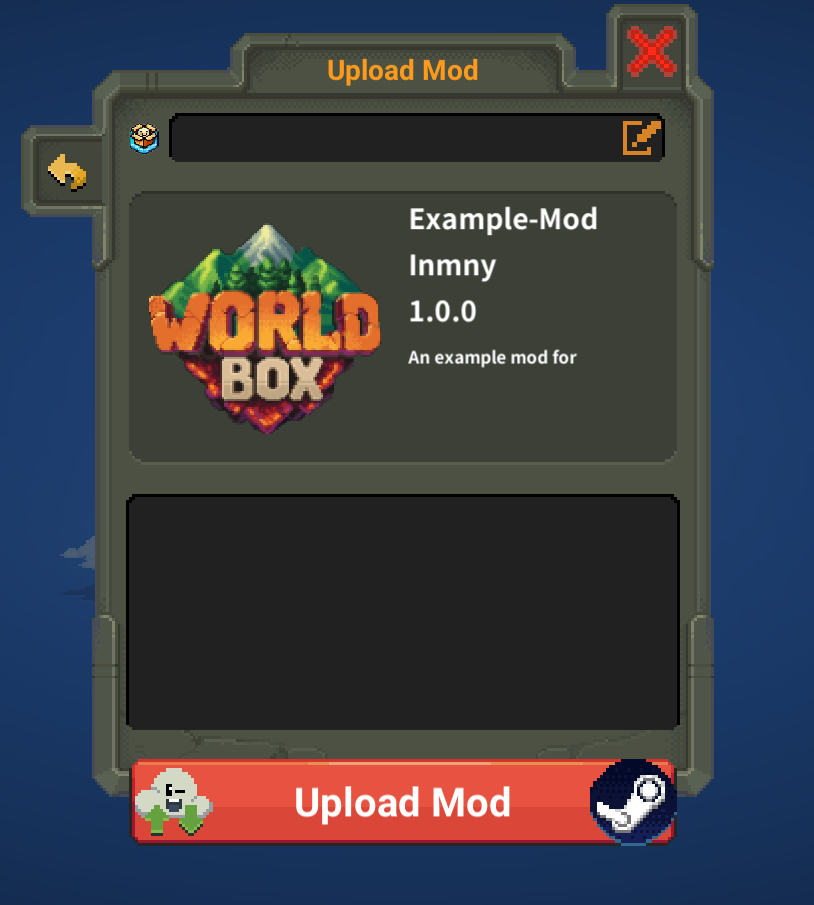

# Introduction

You can upload mod to workshop in game. And you should upload mod in game to provide a basic guarantee that your mod works.

# How to upload

Click mod icon eight times exactly and interval should be less than 1s. Then wait for 3s, an upload window should pop up. Like this:

The top field is used to input `fileID` when editing your item on workshop. Keep it empty if you upload a mod first time.

The below field is used to input changelog. It can be empty and you can edit it on workshop item page.

## How to edit mod

Similar with uploading, and input `fileID`. You can get your mod's `fileID` in the url of your mod's item page.

# Authentication

If you are uploading a new mod, you need to authenticate. Here are two approaches:

1. Discord
2. Github Organization
3. Skip Authentication

## Discord

You need to have `Modder` role in WorldBox official discord server. Contact with administrator to get it.

## Github Organization

You need to join `WorldBoxOpenMods` organization on github which owns `NML`. Send an email titled "WorldBoxOpenMods" and with your github username as content and your mod as attachment to <wbopenmods@gmail.com>. Then wait for at most a week.

## Skip Authentication

If you skip authentication, your mod will be uploaded with tag `Unverified Mods`.

# Attention

You need to make sure your mod works in any directory.