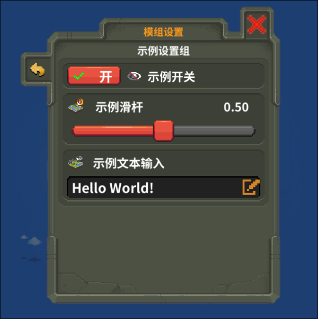

# Introduction

NML provides user friendly interface for `ModConfig`, like below:



[Corresponded config file Example](https://github.com/WorldBoxOpenMods/ModExample/blob/master/default_config.json)

For such a window, you should implements `IConfigurable` interface for your mod main class. Return an instance of `ModConfig` to pass and receive configuration result through `GetConfig`.

For BasicMod, you do not need to consider the above. You only need to create a file named `default_config.json` under your mod folder.(ModTemplate provides a default one), and add/edit it. 

`default_config.json` is an abstract serialized `ModConfig`. It provides a format and default values for configuration. And user's configuration will be saved in other file consistently.

# Edit default_config.json

`default_config.json` is a JSON file.

The file will be serialized into an instance of `Dictionary<string, List<ModConfigItem>>`. Wherein, `string` is configuration group's id `groupId`, `List<ModConfigItem>` is configuration items from top to down.

For `ModConfigItem`, you need provide:

1. `Id`: Unique identifier of the item in the group. It is used to get value of the item in your code.
2. `Type`: Type of configuration item. These are valid: `SWITCH`, `SLIDER`, `TEXT`(text edit).
3. `IconPath`: Path of item icon, it will be loaded through `Resources.Load`. You can leave it empty if you do not need icon for it.
4. `TextVal`: If `Type`=="TEXT", you need to fill the item(string) as default value of text edit.
5. `FloatVal`: If `Type`=="SLIDER", you need to fill the item(float) as default value of slider.
6. `BoolVal`: If `Type`=="SWITCH", you need to fill the item(bool) as default value of switch button.
7. `MinFloatVal`: If `Type`=="SLIDER", you can fill the item(float) as minimum value of slider, default to be 0.
8. `MaxFloatVal`: If `Type`=="SLIDER", you can fill the item(float) as maximum value of slider, default to be 1.
9. `Callback`: Callback method name. It's optional.

For `Callback`, you need to define a static method, the method accepts a parameter(Type of the parameter should be the type of `ModConfigItem`'s value). For such a `ModConfigItem`:

```json
{
    "Id": "Example",
    "Type": "SLIDER",
    "FloatVal": 0.5,
    "Callback": "ExampleType:ExampleCallbackMethod"
}
```

You need to implement such a method below

```csharp
namespace ANYNAMESPACE;

class ExampleType
{
    void ExampleCallbackMethod(float pUpdatedValue)
    {
        // Your callback method's code
    }
}

```

[Callback Example](https://github.com/WorldBoxOpenMods/ModExample/blob/master/content/ExampleActions.cs)

To be attention, changes of mod configuration will be applied after configuration window closed instead of realtime.

Except above, you need to provide locale for `groupId` and `Id`. As for how to provide locale, you can see [Multilingual](Multilingual.md)