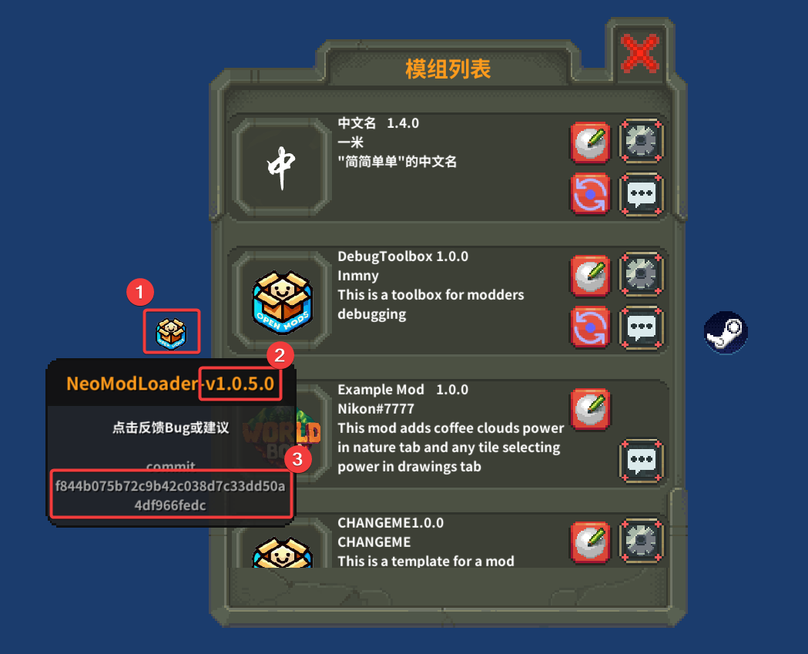
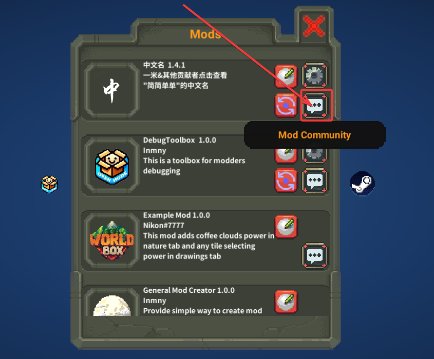

# Install Mods

There are multiple ways to install mods:
1. Subscribe on Steam Workshop.
2. Install through [TMM](https://gamebanana.com/tools/15835)
3. Download from GameBanana or other websites, and put it in GAMEPATH/Mods folder

# Enable/Disable Mods

Click mod's icon in "Mods" window to enable/disable a mod. Some mods can be enabled/disabled at runtime. Most mods require restarting game manually.

# Mod Status

1. Loaded normally: normal color
2. Disabled: grey
3. Problems when loading: red

# Mod Configuration

Some mods have "Mod Configuration" button at right in "Mods" window. You can configure them.

# Problems on loading mods

First, check [TroubleShoot](./Attention.md). If there are still problems, go to [Discord modding-talk](https://discord.com/channels/522561390330904585/647736347980726273).

# Bug Feedback/Suggestion

## NeoModLoader

Report bug on [ISSUE](https://github.com/WorldBoxOpenMods/ModLoader/issues/new?assignees=&labels=bug&projects=&template=bug-report-en.yaml&title=%5BBug%5D%3A+)

Get NML version and commit:

Move mouse to point 1.

## Other mods

Feedback here:

If you jump to `https://github.com/WorldBoxOpenMods`, it means the mod does not provide relevant page or url. Go to [the mod's thread on Discord](https://discord.com/channels/522561390330904585/1031941725318553600) or [Discord modding-talk](https://discord.com/channels/522561390330904585/647736347980726273).