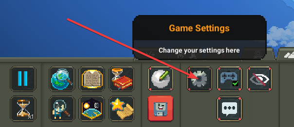
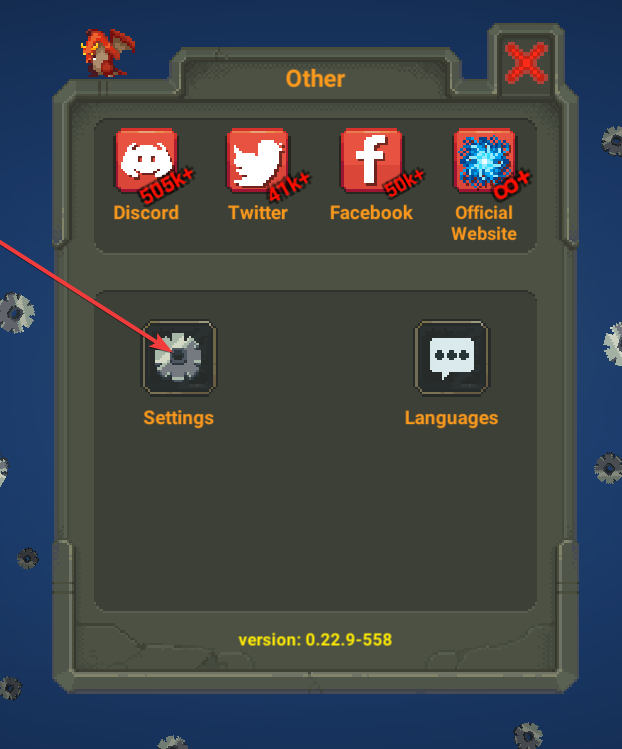
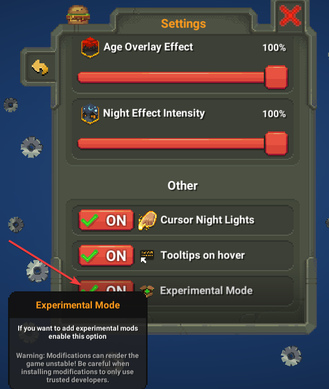
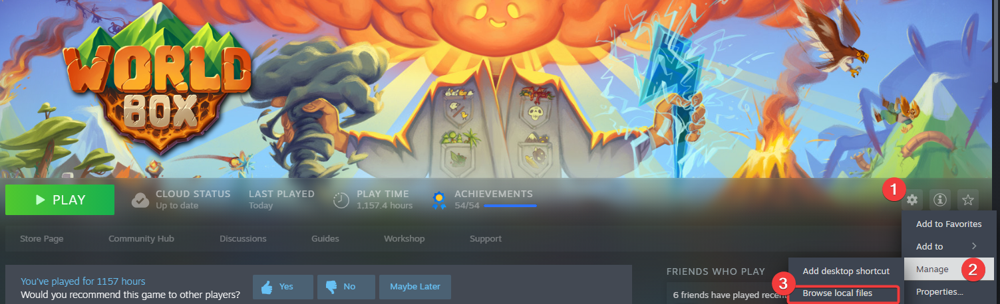
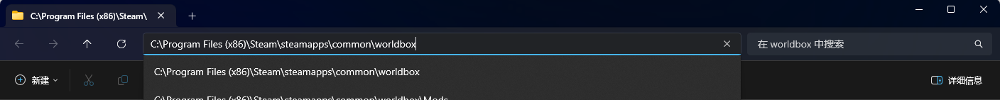
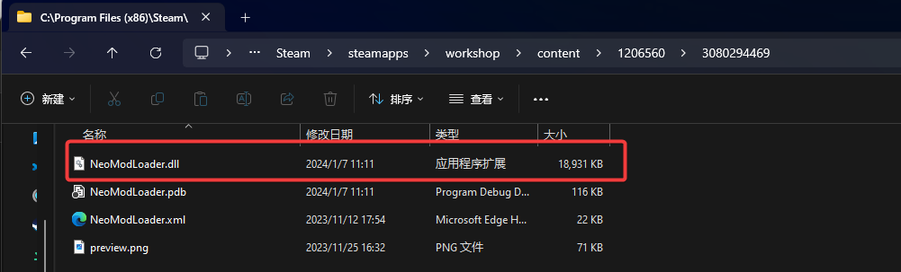

Because NML has not support from Maxim, it cannot be loaded from workshop directly. You need to install it manually for the first.

# Prepare

Mods require "Experimental Mode" enabled. So first of all, enable "Experimental Mode" in game Settings/Settings/Experimental Mode.

# Get NML File

## Steam Workshop

### Download

Subscribe the item on the [website](https://steamcommunity.com/sharedfiles/filedetails/?id=3080294469) and wait for downloading completed.

### Find File

Change `common/worldbox` to `workshop\content\1206560\3080294469`

The selected file is neccessary.

## Github

### Download

Goto [Github Releases](https://github.com/WorldBoxOpenMods/ModLoader/releases) or other mirror stations download the latest released `.dll` file.

### Suggestions

It is recommended to subscribe to the NML item on the Steam Workshop to receive automatic updates.

# Install NML

Easily, move `NeoModLoader.dll` to appropriate path.

First, go to game path:

## Windows/Linux

Go to `worldbox_Data/StreamingAssets/mods` under game folder

## MacOS

 >Right-click the worldbox icon in the worldbox folder, select "Show Package Contents", then go to Contents, then Resources, then Data, then StreamingAssets, then mods.<a href="#ref1">1</a>

# References

 1. <a name = "ref1" href="https://gamebanana.com/tuts/16262#H2_7">Key44, A Beginner's Guide On How To Install WorldBox Mods</a>