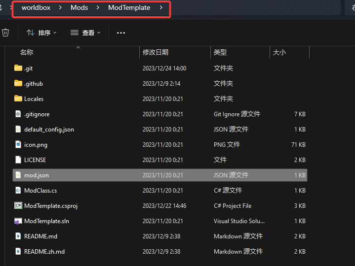

There are two options: create from mod template or from empty folder.

- [Create from mod template](#create-from-mod-template)
- [Create from empty folder](#create-from-empty-folder)
  - [Create folder](#create-folder)
  - [Configure IDE](#configure-ide)
- [Load your mod](#load-your-mod)

# Create from mod template

If you know how to use git and have SSH Key configured on Github, just execute the command under `GAMEPATH/Mods`

```shell
git clone git@github.com:WorldBoxOpenMods/ModTemplate.git <ModName>
```

Otherwise, download [ModTemplate](https://github.com/WorldBoxOpenMods/ModTemplate/archive/refs/heads/master.zip), and unzipped it under the folder `GAMEPATH/Mods`.

Then your folder structure should be like this. Pay attention to directory.



There are several files neccessary to modify

1. `mod.json` Modify value of "name" to mod name, "author" to author name. "GUID" to global unique ID of your mod(Determine the ID by yourself to avoid collision with other mods)
2. `ModClass.cs` Modify "CHANGEME" to your mod's namespace, and avoid collision with other mods

Then initialize your mod in `OnModLoad` in file `ModClass.cs`. `BasicMod` inherits from `MonoBehaviour`, you can implement other methods of `MonoBehaviour` like `Update`. 


# Create from empty folder

## Create folder
Create a folder under `GAMEPATH/Mods`, create such two files `mod.json` and `Main.cs` like below. 

If you use IDE, you should create a `.Net Framework4.8` project under `GAMEPATH/Mods` and then create the two files `mod.json` and `Main.cs` below. You can create the project through IDE or write it manually refer to [Configure your IDE manually](#Configure-IDE) 

```json
// mod.json
{
    "name": "Change me to Mod name",
    "author": "Change me to Author name",
    "version": "Change me to Mod version",
    "description": "Change me to Mod description",
    "GUID": "Change me to Global Unique ID of your mod"
}
```

```csharp
// Main.cs
using UnityEngine;
using NeoModLoader.api;
using NeoModLoader.services;
namespace CHANGEME_TO_YOUR_NAMESPACE;

public class ModClass : MonoBehaviour, IMod
{
    private ModDeclare _declare;
    private GameObject _gameObject;
    
    public ModDeclare GetDeclaration()
    {
        return _declare;
    }
    public GameObject GetGameObject()
    {
        return _gameObject;
    }
    public string GetUrl()
    {
        return "URL of your mod's website or item page on workshop";
    }
    public void OnLoad(ModDeclare pModDecl, GameObject pGameObject)
    {
        _declare = pModDecl;
        _gameObject = pGameObject;
        // Initialize your mod.
        // Methods are called in the order: OnLoad -> Awake -> OnEnable -> Start -> Update
        LogService.LogInfo($"[{pModDecl.Name}]: Hello World!");
    }
}
```
## Configure IDE

Add references to your project. Or you can find the `.csproj` example in [ExampleMod.csproj](https://github.com/WorldBoxOpenMods/ModExample/blob/master/ExampleMod.csproj)(DO NOT COPY ALL DIRECTLY. YOU SHOULD DISTINGUISH WHAT IS USABLE)

# Load your mod

You have made a simplest mod now. Launch WorldBox now.

If there are no problems above, you can find this in console:

```log
[NML]: [Mod Name]: Hello World!
```

And you can also find your mod in "Mods" window provided by NML.